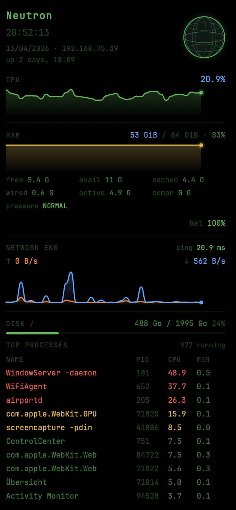

# Monitor — Übersicht Widget

A minimal, transparent macOS system monitor widget for [Übersicht](https://tracesof.net/uebersicht/), built with a **Terminal Homebrew** aesthetic — phosphorescent green on dark, JetBrains Mono font, animated SVG globe.



---

## Features

- 🌐 **Animated SVG globe** in the header
- 📈 **CPU sparkline** — 40-point history, color shifts green → yellow → red
- 🧠 **RAM breakdown** — used / total with sparkline + 6-value detail grid (free, avail, cached, wired, active, compressed) + memory pressure indicator
- 🌐 **Real-time network throughput** — TX ↑ and RX ↓ measured via dual-sample method (1s interval), dual sparkline overlay on shared scale
- 📡 **Ping latency** to 1.1.1.1 displayed live
- 💾 **Disk usage** — APFS-aware: combines system volume + `/System/Volumes/Data`
- 🔋 **Battery** — percentage + charging state
- 🧾 **Top 10 processes** by CPU — color-coded (green → yellow → red)
- ⏱ **Uptime**, date, local IP
- **Fully transparent background** — readable on any wallpaper via text-shadow
- Refreshes every **3 seconds**

---

## Requirements

- [Übersicht](https://tracesof.net/uebersicht/) — tested on macOS Sequoia
- Python 3 (included with macOS)
- Compatible with **Apple Silicon** (M1/M2/M3/M4) and Intel

---

## Installation

```bash
# Clone the repo
git clone https://github.com/xaviergregor/monitor.widget.git 
```
unzip widget.zip and copy the `monitor.widget` folder to:

```
~/Library/Application Support/Übersicht/widgets/
```

Übersicht will detect the widget automatically.

---

## File structure

```
monitor.widget/
├── index.jsx      # Widget UI — React/JSX, SVG sparklines, animated globe
└── stats.py       # Data collector — outputs JSON via subprocess calls
```

---

## How it works

`stats.py` is executed every 3 seconds by Übersicht. It collects system metrics using native macOS tools (`vm_stat`, `netstat`, `ps`, `df`, `pmset`, `ping`, `sysctl`) and outputs a single JSON object. `index.jsx` parses this JSON and renders the UI with SVG sparklines built from an in-memory 40-point history.

Network throughput is measured by taking **two samples 1 second apart** within the same script execution, giving an accurate bytes/sec rate without relying on external state files.

RAM usage follows the **same formula as btop and Activity Monitor**:
```
used = total − (free + inactive + speculative + purgeable)
```

Disk usage correctly handles **APFS split volumes** by summing the system volume (`/`) and the data volume (`/System/Volumes/Data`).

---

## Customization

| Setting | Location | Default |
|---|---|---|
| Widget position | `className` in `index.jsx` | top: 20px, right: 20px |
| Refresh rate | `refreshFrequency` in `index.jsx` | 3000 ms |
| Sparkline history | `MAX_H` in `index.jsx` | 40 points |
| Ping target | `stats.py` | 1.1.1.1 |
| Process count | `stats.py` | Top 10 |

### Colors

The widget uses a consistent **Terminal Homebrew** palette:

```
Background : transparent
Primary    : #3fb950  (phosphorescent green)
Accent     : #58a6ff  (blue — RAM, RX)
TX         : #F77E2D  (Cosmic Orange — upload)
Warn       : #e3b341  (yellow)
Danger     : #f85149  (red)
Font       : JetBrains Mono, Menlo (fallback)
```

---

## Author

**Xavier Gregor** — [gregor.fr](https://www.gregor.fr)

---

## Built with

This widget was designed and built with the assistance of **[Claude](https://claude.ai)** (Anthropic) — iterative development, debugging, and feature additions were done entirely through conversation.

---

## License

MIT
